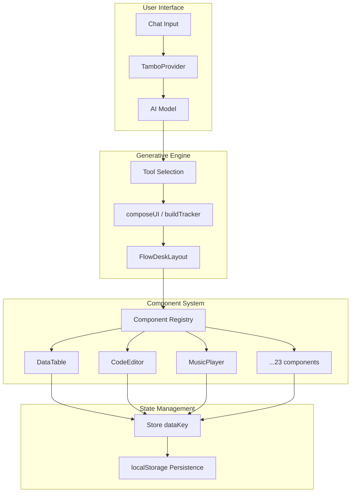

# FlowDesk – Generative UI Engine

**A generative UI engine that converts natural language into fully functional React applications** by dynamically selecting and rendering components using [Tambo](https://tambo.co).

> Users describe what they want. The system generates the interface.

FlowDesk is not a single app. It is a **runtime that builds applications dynamically** by assembling React components based on natural language. Same engine, no code changes between demos.

---

## ✨ Features

| Feature | Description |
|---------|-------------|
| 🎨 **23+ Components** | DataTable, FormBuilder, ChartView, KanbanBoard, CodeEditor, Terminal, MusicPlayer, Whiteboard, and more |
| ⌨️ **Command Palette** | Press `Ctrl+K` to quickly navigate, switch themes, or launch workspace templates |
| 🚀 **Template Workspaces** | One-click launch of pre-built workspaces: Developer Pro, Content Creator, Student Hub, Relaxation Mode, Data Analyst |
| 🤖 **Smart AI Suggestions** | Context-aware component recommendations (e.g., "I'm tired" → MusicPlayer + Pomodoro) |
| 📐 **Drag & Resize Layout** | React Grid Layout integration for customizable component arrangement |
| 🎭 **Smooth Animations** | Framer Motion for polished transitions between tabs and component entry |
| 🔍 **Global Search** | Search across notes, tasks, and spreadsheet data |
| 🌓 **Theme Support** | Dark/light mode with persistent preferences |
| 💾 **Auto-Persistence** | Components auto-save data to localStorage |

---

## 🚀 Quick Start

```bash
# 1. Clone the repository
git clone https://github.com/your-repo/flowdesk.git
cd flowdesk

# 2. Install dependencies
npm install

# 3. Set up environment
cp example.env .env
# Edit .env and add your VITE_TAMBO_API_KEY (get one at tambo.co/dashboard)

# 4. Start development server
npm run dev
```

Open [http://localhost:5173](http://localhost:5173) and start building!

---

## 🏗️ Architecture



### Core Concepts

1. **Component Registry** – Maps type strings to React components
2. **FlowDeskLayout** – Dynamic grid renderer with drag/resize support
3. **Store (dataKey)** – In-memory store for component data wiring
4. **Tambo Tools** – AI-callable functions that return component configurations

---

## 📁 Project Structure

```
src/
├── App.tsx                 # Main app with Command Palette, Tour, Search
├── components/
│   ├── FlowDeskLayout.tsx  # Grid-based dynamic renderer
│   ├── CommandPalette.tsx  # Ctrl+K command interface
│   ├── OnboardingTour.tsx  # First-visit guided walkthrough
│   ├── GlobalSearch.tsx    # Cross-component search
│   ├── ErrorBoundary.tsx   # Graceful error handling
│   ├── EmptyState.tsx      # Reusable empty state
│   ├── DataTable.tsx       # Data grid component
│   ├── CodeEditor.tsx      # Monaco-based code editor
│   ├── MusicPlayer.tsx     # Audio player with playlist
│   ├── Terminal.tsx        # Shell emulator
│   └── ... (23 total)
├── lib/
│   ├── tambo.ts            # Tambo components & tools config
│   ├── registry.tsx        # Component type → React mapping
│   ├── store.ts            # DataKey-based state
│   ├── templates.ts        # Pre-built workspace templates
│   ├── persistence.ts      # Theme & workspace persistence
│   └── workspaces.ts       # Workspace management
└── index.css               # Tailwind + custom styles
```

---

## 🎯 Demo Script

1. **Open the app** – See the welcome screen
2. **Press `Ctrl+K`** – Open the Command Palette
3. **Launch "Developer Pro"** – One-click workspace with CodeEditor, Terminal, TaskList
4. **Type: "Build an expense tracker"** – Watch the AI generate DataTable + Form + Chart + Metric
5. **Drag and resize** – Customize the layout
6. **Add data** – See components update in real-time

---

## 🎮 Keyboard Shortcuts

| Shortcut | Action |
|----------|--------|
| `Ctrl+K` | Open Command Palette |
| `↑` `↓` | Navigate commands |
| `Enter` | Execute selected command |
| `Escape` | Close palette/modal |

---

## 🛠️ Available Components

| Category | Components |
|----------|------------|
| **Data** | DataTable, FormBuilder, ChartView, MetricCard, Spreadsheet |
| **Organization** | KanbanBoard, TaskList, JobTracker, NotesApp |
| **Productivity** | CodeEditor, Terminal, Browser, Calculator, PomodoroTimer |
| **Media** | MusicPlayer, YouTubePlayer, PDFViewer, ImageViewer |
| **Content** | TextEditor, RichTextEditor, Whiteboard |
| **Utilities** | WeatherWidget, QuickLinks |

---

## 🤖 Tambo Tools

| Tool | Description |
|------|-------------|
| `composeUI` | Build custom UI from component list |
| `buildExpenseTracker` | Pre-configured expense tracking workspace |
| `buildJobTracker` | Job application Kanban + table |
| `buildBugTracker` | Bug tracking with Kanban board |

---

## 💡 Smart Suggestions

The AI understands context and suggests appropriate component combinations:

| User Says | AI Suggests |
|-----------|-------------|
| "I'm tired" / "need a break" | MusicPlayer + PomodoroTimer + WeatherWidget |
| "code" / "develop" | CodeEditor + Terminal + TaskList + PomodoroTimer |
| "study" / "learn" | NotesApp + TaskList + Calculator + PomodoroTimer |
| "analyze data" | Spreadsheet + DataTable + ChartView + Calculator |
| "write" / "create content" | RichTextEditor + NotesApp + MusicPlayer |

---


## 📚 Tech Stack

- **Frontend:** React 18, Vite, TypeScript, Tailwind CSS
- **Generative UI:** Tambo SDK
- **Code Editor:** Monaco Editor
- **Charts:** Recharts
- **Animations:** Framer Motion
- **Icons:** Lucide React
- **Layout:** React Grid Layout
- **Onboarding:** React Joyride
- **Data:** In-memory store with localStorage persistence

---

## 
This project was developed with the assistance of AI-powered tools during different stages of development. These tools were used as productivity enhancers and learning aids, not as a replacement for core design or engineering decisions.

AI Tools Used

ChatGPT – for ideation, architecture discussions, debugging support, and refining the overall system design.

Cursor – as an AI-assisted code editor to speed up development, refactoring, and boilerplate generation.

Antigravity – for exploratory reasoning, alternative solution validation, and cross-checking design decisions.

---

## 🔗 Links

- [Tambo Documentation](https://docs.tambo.co)
- [Get a Tambo API Key](https://tambo.co/dashboard)

---

*"FlowDesk is a generative UI engine that converts natural language into fully functional React applications by dynamically selecting and rendering components using Tambo."*
